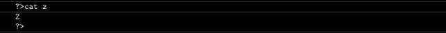
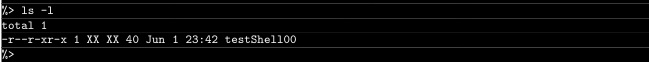
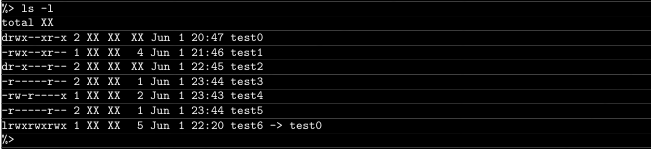
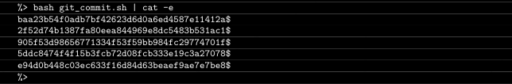
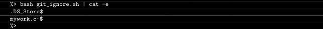
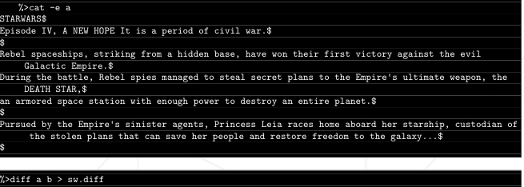

# C Piscine Shell 00

## Introduction

## This repository contains my solutions for the C Piscine Shell 00, a set of exercises focusing on shell scripting. Each exercise is designed to enhance my understanding of shell commands, scripting, and Git usage.

## Exercise 00 : Z
Create a file called z that returns "Z", followed by a new line, whenever the command
cat is used on it

## Excercise 01: testShell00
Figure out a way for the output to look like this (except for the “total 1” line):

## Excercise 02: Oh yeah, mooore...
Create the following files and directories. Do what’s necessary so that when you
use the ls -l command in your directory, the output will looks like this :

## Exercise 03: SSH me!
Create your own SSH key.
Add the public key to the repository in a file named id_rsa_pub.
Update the SSH key on the intranet for repository pushing.

## Exercise 04: midLS
Create a shell script (midLS) that lists all files and directories in the current 
directory (excluding hidden files) by order of modification date.

Directories should be followed by a slash character.

## Exercise 05: GiT commit
Create a shell script (git_commit.sh) that displays the ids of the last 5 commits of your Git repository.

# Bonus

## Exercise 06: gitignore
Write a shell script (git_ignore.sh) that lists all files ignored by your Git repository.

## Exercise 07: diff
Create a file b based on the provided content in the exercise description.
Use diff to compare files a and b, saving the output to sw.diff.

## Exercise 08: clean
Create a file (clean) with a command line that searches for and erases files with specific
names in the current directory and its sub-directories.

## Exercise 09: Illusions, not tricks, Michael...
Create a magic file (ft_magic) formatted to detect files of type "42" built with a "42" string at the 42nd byte.
