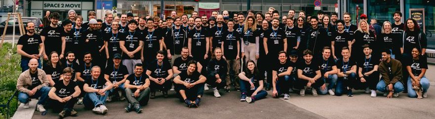

    

<h1 align="center">
   Piscine March 2023
</h1>

The Piscine at 42 is an intense and immersive coding bootcamp designed by 42, a global network of coding schools. 

"Piscine" is French for swimming pool, and the term is used to describe a rigorous programming challenge.

During the Piscine, participants undergo an intensive, month-long coding experience where they engage in hands-on coding projects, teamwork, and problem-solving exercises.

The Piscine serves as a selection process for potential students to enter 42's full-time coding program, testing their adaptability, perseverance, and aptitude for 
    coding in a collaborative and fast-paced environment. Participants learn and apply programming skills across various domains, fostering a culture of self-learning and teamwork.
